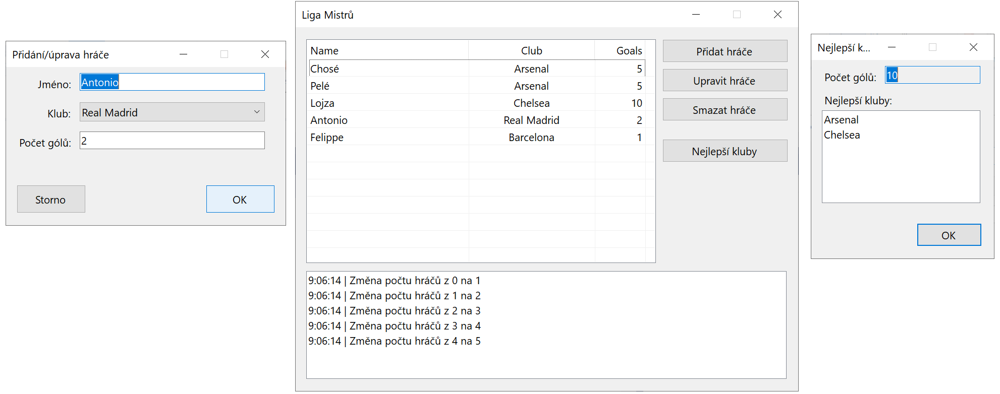

# Liga Mistrů

Vytvořte desktopovou aplikaci (Windows Forms), která bude sloužit pro správu střelců Ligy Mistrů. Aplikace eviduje hráče, jejich kluby a počty gólů. Aplikace umožňuje vyhodnotit nejlepší kluby (dle celkového počtu střelených gólů).

## Postup
* Pro vytvoření nového okna nastudujte metody **Form.Show** a **Form.ShowDialog** (a související vlastnost **DialogResult** u **Button**)
* Nejdříve dokončete a vytvořte třídy v knihovně **ChampionsLeagueLibrary**
  * Doporučené pořadí implementace: _FootballClub.cs_, _Player.cs_, _PlayerRecords.cs_
  * Třídy, struktury a delegáty vytvářené v knihovně musejí být veřejné
  * Vlastnosti tříd a struktur jsou veřejné, pokud není uvedeno jinak
  * Jmenný prostor knihovny je **ChampionsLeagueLibrary**
  * Pro projekt knihovny jsou k dispozici jednotkové testy, které ověřují její správnou funkčnost
    * Testy jsou postaveny pomocí reflexe a neměly by blokovat kompilaci a testování i v případě rozpracovaného projektu
* Poté implementujte aplikaci
  * Na obrázku výše je uvedeno předpokládané minimální rozhraní aplikace
    * Pro zobrazení hráčů použijte **ListBox**, **ListView** nebo **DataGridView**
    * Pro výběr klubu při přidání/editaci hráče použijte **ComboBox**
    * Pro výpis událostí (pole dole) **ListBox**
    * V případě výskytu chyb při zadávání dat využijte vhodně formátované dialogy z třídy **MessageBox**
  * Pro uchování záznamů hráčů použijte třídu **PlayerRecords**
    * Pro záznam změn počtů hráčů využijte událost **PlayerRecords.PlayersCountChanged**

